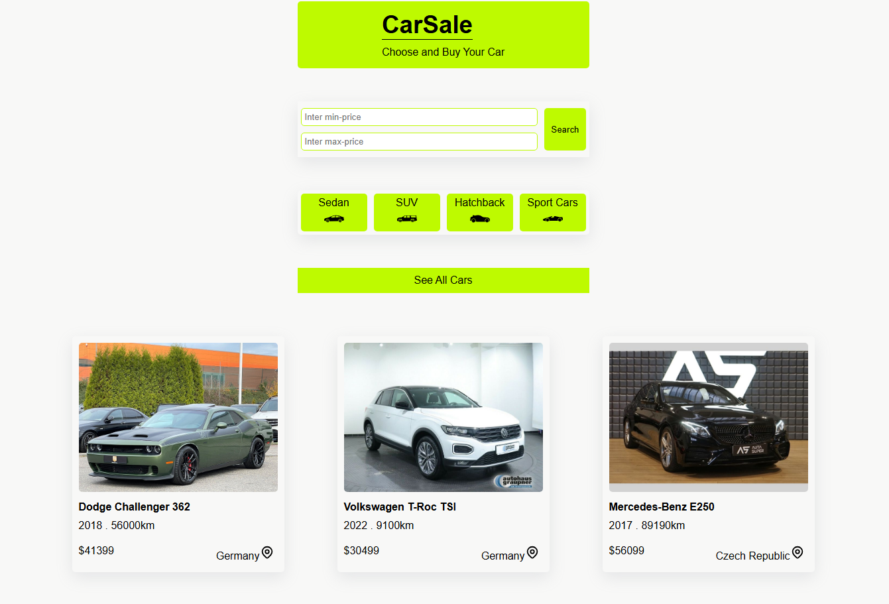
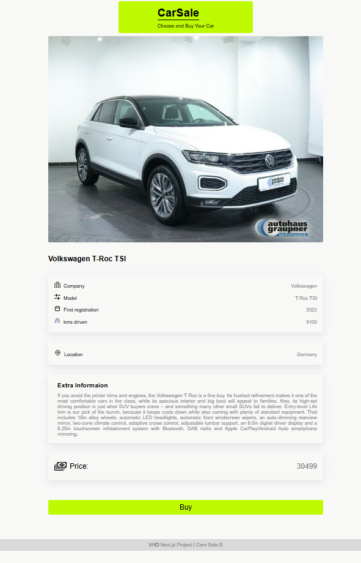

# Cars Project

A simple car listing project built with React and Next.js.

**Live Demo**: [car-sale-project.vercel.app](https://car-sale-project.vercel.app/)

## Screenshots

## Features

- Full folder structure setup
- Price range search with catch-all routing
- Display filtered cars dynamically

## Usage

1. Clone the repo
2. Install dependencies: `npm install`
3. Run the project: `npm run dev`
